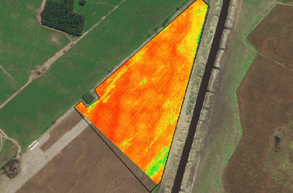

# Portafolio de Desafíos de Procesamiento Natulal del Lenguaje

Desafíos correspondientes a la materia Procesamiento Natural del Leguaje de la Especialización en Inteligenci Artificial de la facultad de ingeniería de la Universidad de Buenos Aires.

## Desafío 1
En este desafio se realizó:
-  Transformacón en una lista de términos de 3 strings.
-  Contrucción de un vector de términos no repetidos.
-  Dada una lista de textos, devolución de una matriz con la representación oneHotEncoding.
-  Dada una lista de textos, devolución de una matriz con la representación de frecuencia.
-  Dada una lista de textos, devolución de una matriz con la representacion TFIDF.
-  Una funcion que reciba el corpus y el índice de un documento y devuelva los documentos ordenados por la similitud coseno.

## Desafío 2
\
A partir de los bots utilizados en la clase 2 de la materia, se tomó uno de ejemplo para la contrución de uno propio.

## Desafío 3
\
Se creó vectores con Gensim basado tomando como dataset la pagina de wikipedia de Messi https://en.wikipedia.org/wiki/Messi.
Ademas, se probaron términos de interés y se entreno el espacio de embeddings.

## Desafío 4
\
Se utilizó como dataset la pagina de wikipedia de Leonardo Da Vinci https://en.wikipedia.org/wiki/Leonardo_da_Vinci y se puso en práctica la predicción de próxima palabra.

## Desafío 5
Utilización de Embeddings + LSTM para clasificar críticas de compradores de ropa. 

## Desafío 6
Construcción de un QA Bot basado.

# Gracias!
Sientanse libre de comunicarse a mi mail brunorais13@gmail.com ante cualquier duda o consulta.
:smile:!!
